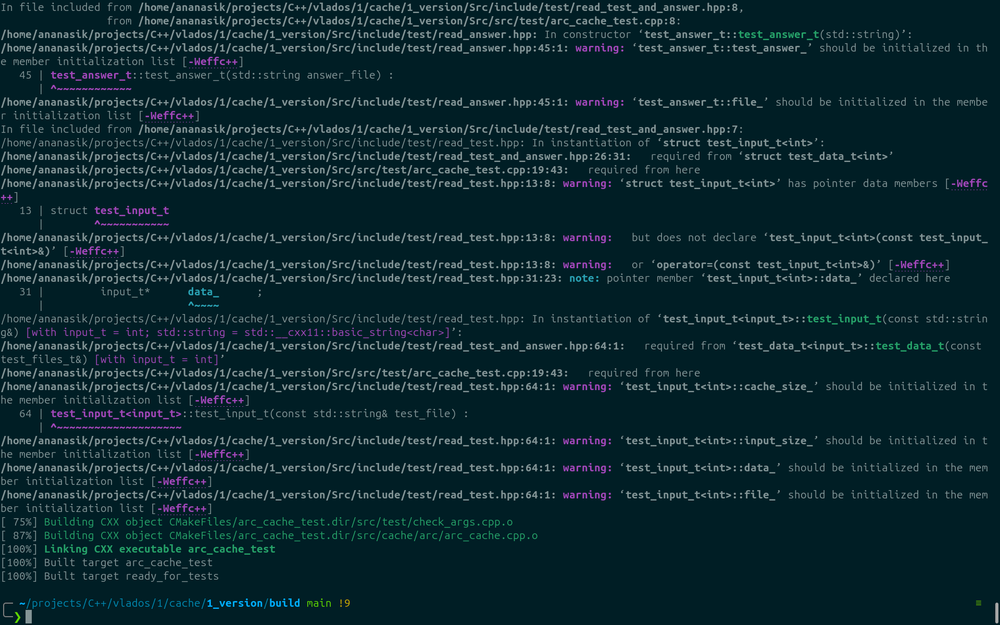

# ARC-кеш (+ Belady-кеш) от студентов 2 курса РТ
## Авторы: Лобачев Артем, Себелев Максим

## Зависимости:
У проекта *нет обязательныз зависимостей*, но для удобной работы могут понадобиться:\
[git](https://git-scm.com/ "ссылка на официальный сайт git")\
[make](https://www.gnu.org/software/make/ "ссылка на оффициальный сайт make") \
[cmake](https://cmake.org/ "ссылка на официальный сайт cmake")\
[g++](https://gcc.gnu.org/ "а у кого нет?")

## Установка:
```bash
git clone https://github.com/Maksim-Sebelev/Cache
```
## Начало работы:
```bash
cd Cache/
mkdir build/
cd build
cmake -S ../Src -DCMAKE_BUILD_TYPE=Release # или =Debug для дебажной версии
```

## Комплиляция:
```bash
make
```

# Тестирование

## запуск тестов:
```bash
make test 
```
или для более подробной информации:
```bash
ctest --verbose
```

# Структура проекта
```txt
.
├── build # рабочая директория (создается Вами)
│   └── <some files created with cmake>
├── .gitignore
├── README.md
├── assets
│   └── weffc++.png
├── project_struct
│   └── project_struct.txt
├── Src
│   ├── CMakeLists.txt
│   ├── include
│   │   ├── cache
│   │   │   ├── arc
│   │   │   │   └── arc_cache.hpp
│   │   │   └── optimal
│   │   │       └── optimal_cache.hpp
│   │   └── test
│   │       ├── check_args.hpp
│   │       ├── get_test_data.hpp
│   │       ├── input_stream.hpp
│   │       ├── parse_args.hpp
│   │       ├── read_answer.hpp
│   │       ├── read_test.hpp
│   │       └── test_files.hpp
│   └── src
│       └── test
│           ├── arc_cache_test.cpp
│           ├── check_args.cpp
│           └── optimal_cache_test.cpp
└── tests
    ├── arc
    │   ├── ans
    │   │   ├── 1.ans
    │   │   ├── 2.ans
    │   │   ├── 3.ans
    │   │   ├── 4.ans
    │   │   ├── 5.ans
    │   │   ├── 6.ans
    │   │   ├── 7.ans
    │   │   └── 8.ans
    │   └── dat
    │       ├── 1.dat
    │       ├── 2.dat
    │       ├── 3.dat
    │       ├── 4.dat
    │       ├── 5.dat
    │       ├── 6.dat
    │       ├── 7.dat
    │       └── 8.dat
    └── optimal
        ├── ans
        │   ├── 1.ans
        │   ├── 2.ans
        │   ├── 3.ans
        │   ├── 4.ans
        │   ├── 5.ans
        │   ├── 6.ans
        │   ├── 7.ans
        │   ├── 8.ans
        │   └── 9.ans
        └── dat
            ├── 1.dat
            ├── 2.dat
            ├── 3.dat
            ├── 4.dat
            ├── 5.dat
            ├── 6.dat
            ├── 7.dat
            ├── 8.dat
            ├── 9.ans
            └── 9.dat

18 directories, 51 files
```
## Объяснение алгоритма ARC (adaptive replacement cache):

[arc cache](https://miro.com/app/board/uXjVJIsDL80=/?focusWidget=3458764640319423359) \
UPD: Грязные капиталюги не дали сделать pdf/хорошего качество фото 


## Как тестируются алгоритмы кеширования?
На вход программа получает размер кеша, количество запросов и сами запросыб. Проверяемым параметром является количество попаданий в кеш (ситуаций, когда вместо долгой подкачки страницы, алгоритм берет ее из быстрого кеша).\
Разберем на примере (мы находимся в папке `build` (см. структуру проекта)):
```bash
./arc_cache_test
5 # размер кеша
8 # количество запросов
1 2 3 4 5 1 2 3 # сами запросы (ровно 8 штук)
```

После чего программа выведет:
```bash
3 # количество попаданий в кеш
```

## Как работает тестирование?
Разберем как прочитать данные из файлов для тестов:
```bash
./arc_cache_test --input_stream=files test.dat test.ans
```
## Важное замечание:
Для тестов программа принимает **исключительно** `.dat` файлы, а для ответов `.ans`

Программа имеет параметр `input_stream`, который принимает 2 значения:
`stdin` и `files`. Первое значение является значением по умолчанию. Это означает, что без явного указания иного, программа ожидает данные с `stdin` и отдает результат в `stdout`. Так же есть краткая форма данной опции `-i`
Таким образом, следующие 3 команды эквивалетны:
```bash
./arc_cache_test
# ожидает данные с stdin
```
```bash
./arc_cache_test --input_stream=stdin
# ожидает данные с stdin
```
```bash
./arc_cache_test -istdin
# ожидает данные с stdin
```

## Как добавить тесты?
Тестирование происходит сразу для двух алгоритмов - arc и belady. \
Вот так на момент написани README.md выглядит структура папки `tests`:
```txt
tests
    ├── arc
    │   ├── ans
    │   │   ├── 1.ans
    │   │   ├── 2.ans
    │   │   ├── 3.ans
    │   │   ├── 4.ans
    │   │   ├── 5.ans
    │   │   ├── 6.ans
    │   │   ├── 7.ans
    │   │   └── 8.ans
    │   └── dat
    │       ├── 1.dat
    │       ├── 2.dat
    │       ├── 3.dat
    │       ├── 4.dat
    │       ├── 5.dat
    │       ├── 6.dat
    │       ├── 7.dat
    │       └── 8.dat
    └── optimal
        ├── ans
        │   ├── 1.ans
        │   ├── 2.ans
        │   ├── 3.ans
        │   ├── 4.ans
        │   ├── 5.ans
        │   ├── 6.ans
        │   ├── 7.ans
        │   ├── 8.ans
        │   └── 9.ans
        └── dat
            ├── 1.dat
            ├── 2.dat
            ├── 3.dat
            ├── 4.dat
            ├── 5.dat
            ├── 6.dat
            ├── 7.dat
            ├── 8.dat
            ├── 9.ans
            └── 9.dat
```
Положим `.` корневой папкой проекта.
Если Вы хотите добавить тесты для `arc cache`, то добавьте в папку `./tests/arc/dat/` файлы с соответсвующим содержимым и названиями `<n>.dat`.
Для каждого вашего теста добавьте в папку `./tests/ans/arc/` соотвествующий файл с тем же названием, что и его тестовый файл `<n>.ans`.\
Аналогично для `optimal cache`.\
После чего выполните
```bash
cmake ../Src -DCMAKE_BUILD_TYPE=Release
make test
```
из папки `./build`. Ваши тесты будут включеные в тестирование и Вы увидете всю необходимую информацию о ваших тестах.

## Почему авторов двое?
В силу ограниченности времени обязанности написания проекта были распределены: Максим писал тестироавание + Cmake, Артем писал алгоритмы кеширования (arc + belady).\
Но это не значит, что каждый делал только свое дело, не разбираясь в деле сокомандника. По итогу каждый получил опыт написания кеша, опыт работы с Cmake и опыт написания тестов (самое сложно было заставить cmake эти тесты делать)

# Проблемы проекта:
## 1
Мы прекрасно знаем, что Cmake лучше знает какие флаги для релизной и дебажной версии нужны.
О чем говорил Константин Владимиров в своей лекции по системам сборкам.
Но мы не удержались, чтобы насильно не воткнуть так называемые "флаги Деда" (Дед = Дединский Илья Рудольфович), которые служили нам верой и правдой весь 1 курс. И здесь они себя неплохо проявили, показав множество неточностей и неэффективностей в коде.\
Особое внимание заслужил флаг `-Weffc++`. Он единолично заставлял сиять наши экраны от бесконечных warning



поэтому в целях экономии времени и неполного понимания его претензий к коду он был позорно занесен под комментарий (но не удален).

```cmake
set(DEBUG_FLAGS
    -g -D _DEBUG -ggdb3 -O0 -Wall -Wextra -Wcast-align -Wcast-qual -Wchar-subscripts -Wconditionally-supported -Wmissing-declarations -Wformat-security -Wformat-signedness -Wformat=2 -Winline -Wlogical-op -Wnon-virtual-dtor -Wopenmp-simd -Woverloaded-virtual -Wpacked -Wpointer-arith -Wconversion -Wctor-dtor-privacy -Wempty-body -Wfloat-equal -Wformat-nonliteral -fstrict-overflow -flto-odr-type-merging -fno-omit-frame-pointer -Wstack-usage=8192 -Winit-self -Wredundant-decls -Wshadow -Wsign-conversion -Wsign-promo -Wstrict-null-sentinel -Wstrict-overflow=2 -Wsuggest-attribute=noreturn -Wsuggest-final-methods -Wsuggest-final-types -Wsuggest-override -Wswitch-default -Wsync-nand -Wundef -Wunreachable-code -Wunused -Wuseless-cast -Wvariadic-macros -Wno-literal-suffix -Wno-missing-field-initializers -Wno-narrowing -Wno-old-style-cast -Wno-varargs -Wstack-protector -fcheck-new -fsized-deallocation -fstack-protector -pie -fPIE -Werror=vla
    # -Weffc++
)
```
## 2
Реализован класс `template <typename input_t> class test_data_t`, который **полностью** отвечает за получение тестовых данных. Данные можно получить 2 спобосами:
со стандартного потока или с файлов (регулируется параметрами командной строки). Но в универсальности класса кроестся проблема:\
у класса есть 2 конструктора: для чтения с stdin и для чтения с файлов.  

